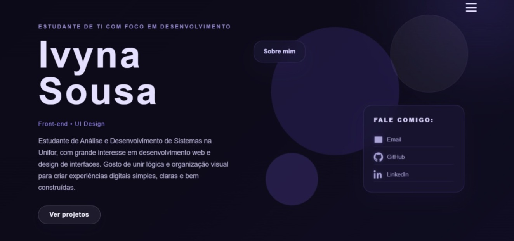

# Portfolio: Ivyna Sousa Rodrigues

Sou estudante de Análise e Desenvolvimento de Sistemas com foco na intersecção entre o código e o design. Acredito que o desenvolvimento de software ganha valor real quando aliado a uma interface bem pensada e uma experiência de uso fluida.

Neste repositório, apresento a estrutura do meu portfólio pessoal, onde aplico conceitos de front-end e organização visual.

*Prévia do layout desenvolvido apenas com html e css.*

---

### Sobre o meu trabalho 

Atualmente, meu foco está em consolidar a base de desenvolvimento web (HTML, CSS e JavaScript) e explorar ferramentas de design como o Figma para a prototipagem de interfaces.

**Principais interesses e estudos:**

* Desenvolvimento Front-end focado em responsividade.
* UI/UX Design e acessibilidade.
* Integração de serviços em nuvem.
* Organização de código e performance de carregamento.

### Estrutura técnica

O projeto utiliza uma estrutura limpa de arquivos para garantir manutenção simples e carregamento otimizado das imagens. O estilo foi construído do zero para refletir minha identidade visual e habilidades técnicas em CSS.

### Tecnologias utilizadas

- HTML
- CSS
- Flexbox
- CSS Grid
- Keyframes animations
- Design prototipado no Figma

---

### Contato

[IvynaRodrigues@email.com]